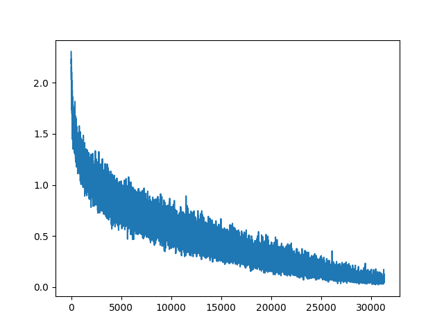
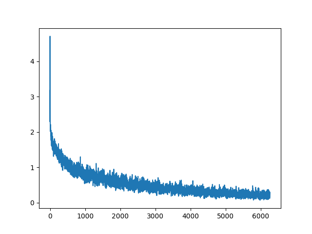
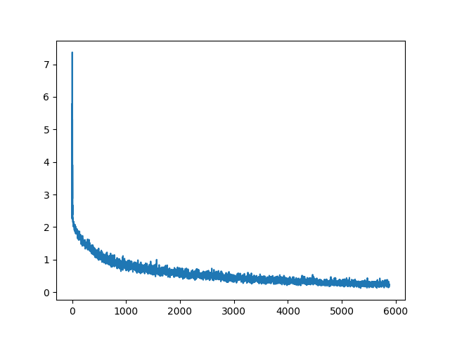
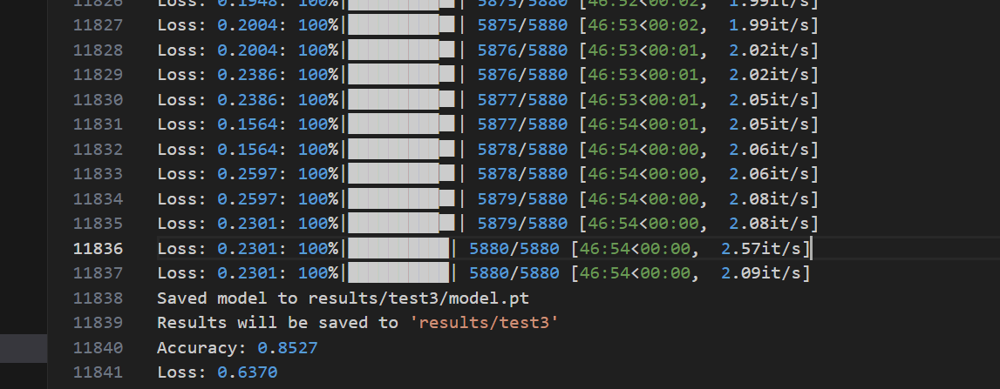

# lab2
## 实验目的
使用卷积神经网络在CIFAR-10数据集上进行图像分类
## 实验内容
### 1.代码框架
1. ``utils.py``: 工具函数包
2. ``model.py``: 模型定义
3. ``train.py``: 训练脚本,并在验证集上评估模型性能
4. ``eval.py``: 在测试集上评估模型性能
5. ``accelerate_config.ymal``: 配置文件
### 2.网络结构
总体结构为: 

Conv_in -> n*ResnetBlock -> FC -> Dropout -> FC -> Output 
 
在前两个``ResnetBlock``后使用了``MaxPooling``层,其中``ResnetBlock``定义如下: 
```python
class ResnetBlock(nn.Module):
    """
    Residual block with group normalization, SiLU activation, and dropout.

    Args:
        - in_channels: number of input channels
        - out_channels: number of output channels
        - norm_groups: number of groups for group normalization
        - dropout_prob: dropout probability

    Inputs:
        - x: input tensor of shape (B, C, H, W)

    Outputs:
        - output tensor of shape (B, out_channels, H, W)
    """
    def __init__(self,
            in_channels: int,
            out_channels: int,
            norm_groups: int,
            dropout_prob: float,
        ):
        super(ResnetBlock, self).__init__()
        self.net1 = nn.Sequential(
            nn.GroupNorm(norm_groups, in_channels),
            nn.SiLU(),
            nn.Dropout(dropout_prob),
            nn.Conv2d(in_channels, out_channels, kernel_size=3, stride=1, padding=1)
        )
        self.net2 = nn.Sequential(
            nn.GroupNorm(norm_groups, out_channels),
            nn.SiLU(),
            nn.Dropout(dropout_prob),
            nn.Conv2d(out_channels, out_channels, kernel_size=3, stride=1, padding=1)
        )
        if in_channels != out_channels:
            self.skip_conv = nn.Conv2d(in_channels, out_channels, kernel_size=1, stride=1)

    def forward(self, x):
        out = self.net1(x)
        out = self.net2(out)
        if hasattr(self, 'skip_conv'):
            x = self.skip_conv(x)
        return x + out
```
我最终选择的网络结构为: 
```log
===================================================================================================================
Layer (type:depth-idx)                   Input Shape               Output Shape              Param #
===================================================================================================================
CNN                                      [1, 3, 32, 32]            [1, 10]                   --
├─Conv2d: 1-1                            [1, 3, 32, 32]            [1, 128, 32, 32]          3,584
├─ModuleList: 1-2                        --                        --                        --
│    └─ResnetBlock: 2-1                  [1, 128, 32, 32]          [1, 256, 32, 32]          --
│    │    └─Sequential: 3-1              [1, 128, 32, 32]          [1, 256, 32, 32]          --
│    │    │    └─GroupNorm: 4-1          [1, 128, 32, 32]          [1, 128, 32, 32]          256
│    │    │    └─SiLU: 4-2               [1, 128, 32, 32]          [1, 128, 32, 32]          --
│    │    │    └─Dropout: 4-3            [1, 128, 32, 32]          [1, 128, 32, 32]          --
│    │    │    └─Conv2d: 4-4             [1, 128, 32, 32]          [1, 256, 32, 32]          295,168
│    │    └─Sequential: 3-2              [1, 256, 32, 32]          [1, 256, 32, 32]          --
│    │    │    └─GroupNorm: 4-5          [1, 256, 32, 32]          [1, 256, 32, 32]          512
│    │    │    └─SiLU: 4-6               [1, 256, 32, 32]          [1, 256, 32, 32]          --
│    │    │    └─Dropout: 4-7            [1, 256, 32, 32]          [1, 256, 32, 32]          --
│    │    │    └─Conv2d: 4-8             [1, 256, 32, 32]          [1, 256, 32, 32]          590,080
│    │    └─Conv2d: 3-3                  [1, 128, 32, 32]          [1, 256, 32, 32]          33,024
│    └─MaxPool2d: 2-2                    [1, 256, 32, 32]          [1, 256, 16, 16]          --
│    └─ResnetBlock: 2-3                  [1, 256, 16, 16]          [1, 512, 16, 16]          --
│    │    └─Sequential: 3-4              [1, 256, 16, 16]          [1, 512, 16, 16]          --
│    │    │    └─GroupNorm: 4-9          [1, 256, 16, 16]          [1, 256, 16, 16]          512
│    │    │    └─SiLU: 4-10              [1, 256, 16, 16]          [1, 256, 16, 16]          --
│    │    │    └─Dropout: 4-11           [1, 256, 16, 16]          [1, 256, 16, 16]          --
│    │    │    └─Conv2d: 4-12            [1, 256, 16, 16]          [1, 512, 16, 16]          1,180,160
│    │    └─Sequential: 3-5              [1, 512, 16, 16]          [1, 512, 16, 16]          --
│    │    │    └─GroupNorm: 4-13         [1, 512, 16, 16]          [1, 512, 16, 16]          1,024
│    │    │    └─SiLU: 4-14              [1, 512, 16, 16]          [1, 512, 16, 16]          --
│    │    │    └─Dropout: 4-15           [1, 512, 16, 16]          [1, 512, 16, 16]          --
│    │    │    └─Conv2d: 4-16            [1, 512, 16, 16]          [1, 512, 16, 16]          2,359,808
│    │    └─Conv2d: 3-6                  [1, 256, 16, 16]          [1, 512, 16, 16]          131,584
│    └─MaxPool2d: 2-4                    [1, 512, 16, 16]          [1, 512, 8, 8]            --
│    └─ResnetBlock: 2-5                  [1, 512, 8, 8]            [1, 1024, 8, 8]           --
│    │    └─Sequential: 3-7              [1, 512, 8, 8]            [1, 1024, 8, 8]           --
│    │    │    └─GroupNorm: 4-17         [1, 512, 8, 8]            [1, 512, 8, 8]            1,024
│    │    │    └─SiLU: 4-18              [1, 512, 8, 8]            [1, 512, 8, 8]            --
│    │    │    └─Dropout: 4-19           [1, 512, 8, 8]            [1, 512, 8, 8]            --
│    │    │    └─Conv2d: 4-20            [1, 512, 8, 8]            [1, 1024, 8, 8]           4,719,616
│    │    └─Sequential: 3-8              [1, 1024, 8, 8]           [1, 1024, 8, 8]           --
│    │    │    └─GroupNorm: 4-21         [1, 1024, 8, 8]           [1, 1024, 8, 8]           2,048
│    │    │    └─SiLU: 4-22              [1, 1024, 8, 8]           [1, 1024, 8, 8]           --
│    │    │    └─Dropout: 4-23           [1, 1024, 8, 8]           [1, 1024, 8, 8]           --
│    │    │    └─Conv2d: 4-24            [1, 1024, 8, 8]           [1, 1024, 8, 8]           9,438,208
│    │    └─Conv2d: 3-9                  [1, 512, 8, 8]            [1, 1024, 8, 8]           525,312
├─Flatten: 1-3                           [1, 1024, 8, 8]           [1, 65536]                --
├─Linear: 1-4                            [1, 65536]                [1, 512]                  33,554,944
├─SiLU: 1-5                              [1, 512]                  [1, 512]                  --
├─Dropout: 1-6                           [1, 512]                  [1, 512]                  --
├─Linear: 1-7                            [1, 512]                  [1, 10]                   5,130
===================================================================================================================
```
### 3.训练策略
1. 首先读取配置文件,并设置随机种子,根据配置文件初始化模型
2. 使用``print_model_summary``函数打印模型结构
3. 读取数据集,按4:1的比例划分训练集和验证集
4. 把所需参数和配置文件导入``Trainer``类,损失函数为``CrossEntropyLoss``,优化器为``Adam``
5. 训练完成后加载``Evaluator``类,评估模型在验证集上的性能
6. 选择一组合适的超参数
### 4.评估策略
1. 读取配置文件,并设置随机种子,根据配置文件初始化模型
2. 读取数据集,使用CIFAR-10自己划分的训练集和测试集
3. 把所需参数和配置文件导入``Trainer``类,这次把训练集和验证集都用于训练
4. 训练完成后再测试集上评估模型的性能,并画出拟合的曲线与真实曲线的比较
### 5.Utils工具包介绍
我在``utils.py``中预先写好了一些工具函数,在这里列出它们的作用: 
1. ``class TrainConfig``: 用于加载训练参数配置
2. ``print_model_summary()``: 打印网络结构并估计需要的显存
3. ``make_dataloader()``: 从数据集中创建数据加载器
4. ``cycle()``: 用于循环迭代器
5. ``maybe_unpack_batch()``: 用于解包批次数据
6. ``make_cifar()``: 用于创建CIFAR-10数据集
7. ``get_date_str()``: 用于记录评估时间
8. ``handle_results_path()``: 处理结果路径,如果不存在则创建
9. ``zero_init()``: 零初始化
10. ``init_config_from_args()``: 从命令行初始化配置文件
11. ``init_logger()``: 初始化记录器
12. ``log()``: 记录器
## 实验步骤
### 1.环境配置
安装依赖
```bash
conda create -n pytorch python=3.9
pip install -r requirements.txt
```
### 2.训练模型
配置文件:
```yaml
compute_environment: LOCAL_MACHINE
distributed_type: NO
fp16: False
mixed_precision: no
num_processes: 1
gpu_ids: all
use_cpu: false
```
运行以默认参数配置开始训练:
```bash
accelerate launch --config_file accelerate_config.yaml train.py
```
或在Linux服务器上:
```bash
bash train.sh
```
### 3.评估模型
运行评估脚本
```bash
python eval.py
```
## 实验结果
在``train.py``中,我们能控制的超参数如下:
```python
    # Architecture
    parser.add_argument("--in-channels", type=int, default=128)
    parser.add_argument("--norm-groups", type=int, default=32)
    parser.add_argument("--dropout-prob", type=float, default=0.5)
    parser.add_argument("--n-resnet-blocks", type=int, default=3)

    # Training
    parser.add_argument("--batch-size", type=int, default=128)
    parser.add_argument("--lr", type=float, default=2e-4)
    parser.add_argument("--seed", type=int, default=123)

    parser.add_argument("--results-path", type=str, default=None)
    parser.add_argument("--epochs", type=int, default=10)
```
除去``seed``和``results-path``外,我们对其他参数进行了调整,分析如下:
1. ``in-channels``: 输入通道数,默认为128,因为CIFAR-10的图像是彩色图像,我们希望选择一个较大的通道数,以便提取更多的特征,当``in-channels``为较小时,模型性能有显著下降
2. ``norm-groups``: 组归一化的组数,默认为32,组归一化是一种归一化方法,它将通道分为若干组,每组进行归一化,这样可以减少模型的过拟合,提高模型的泛化能力,刚开始我选择的是8,但模型性能不佳,考虑到彩色图像的通道数较多,我选择了32,取得了不错的效果
3. ``dropout-prob``: dropout概率,默认为0.5,dropout是一种正则化方法,可以减少模型的过拟合,提高模型的泛化能力,我选择了0.5,因为这是一个较为常用的值,在实验中取得了不错的效果
4. ``n-resnet-blocks``: ResnetBlock的数量,默认为3,当不使用ResnetBlock,只使用两个卷积层时,模型在验证集上只有72%的准确率,使用两层ResnetBlock时,模型在验证集上的准确率达到了81%,三层时达到了83%,再多时准确率没有显著提高,但是参数量过大,因此我选择了3层
5. ``batch-size``: 批次大小,默认为128,考虑到我的设备显存较大,我使用了256,这样可以加快训练速度
6. ``lr``: 学习率,默认为2e-4,我选择了这个学习率,因为根据我之前处理CIFAR-10数据集的经验,这个学习率搭配128~256的批次大小效果较好
7. ``epochs``: 训练轮数,默认为10,我选择了30,超过30时模型在验证集上的loss开始上升,说明模型开始过拟合
 
下面给出几次实验的结果: 
1. 只使用两层卷积,无``ResnetBlock``,准确率为72%
 
2. 使用两层``ResnetBlock``,准确率为81%

3. 使用三层``ResnetBlock``,准确率为83%

 
最终结果,在测试集上选择参数: 
```yaml
batch_size: 256
dropout_prob: 0.5
epochs: 30
in_channels: 128
lr: 0.0002
n_resnet_blocks: 3
norm_groups: 32
results_path: results/test3/
seed: 123
```
 