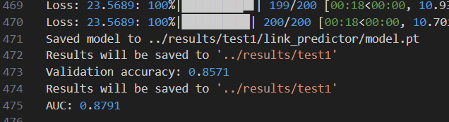
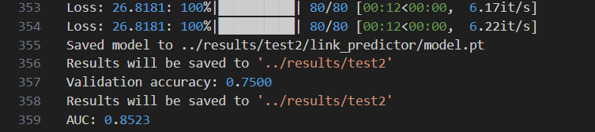

# lab3
## 实验目的
使用GCN对Cora数据集和Citeseer数据集进行节点分类和链路预测任务
## 实验内容
### 1.代码框架
1. ``utils.py``: 工具函数包
2. ``model.py``: 模型定义
3. ``train.py``: 训练脚本,并在验证集上评估模型性能
4. ``eval.py``: 在测试集上评估模型性能
5. ``accelerate_config.ymal``: 配置文件

### 2.网络结构
做节点分类任务时会多过一层``softmax``层, 

``Cora``数据集:
```log
===================================================================================================================
Layer (type:depth-idx)                   Input Shape               Output Shape              Param #
===================================================================================================================
GCN                                      [2708, 1433]              [2708, 7]                 --
├─GCNConv: 1-1                           [2708, 1433]              [2708, 512]               733,696
├─PairNorm: 1-2                          [2708, 512]               [2708, 512]               --
├─ModuleList: 1-3                        --                        --                        --
│    └─GCNConv: 2-1                      [2708, 512]               [2708, 256]               131,072
├─GCNConv: 1-4                           [2708, 256]               [2708, 7]                 1,792
===================================================================================================================
Total params: 866,560
Trainable params: 866,560
Non-trainable params: 0
Total mult-adds (G): 2.35
===================================================================================================================
Input size (MB): 15.69
Forward/backward pass size (MB): 16.79
Params size (MB): 3.47
Estimated Total Size (MB): 35.95
===================================================================================================================
```
``Citeseer``数据集:
```log
===================================================================================================================
Layer (type:depth-idx)                   Input Shape               Output Shape              Param #
===================================================================================================================
GCN                                      [3327, 3703]              [3327, 6]                 --
├─GCNConv: 1-1                           [3327, 3703]              [3327, 3200]              11,849,600
├─PairNorm: 1-2                          [3327, 3200]              [3327, 3200]              --
├─ModuleList: 1-3                        --                        --                        --
│    └─GCNConv: 2-1                      [3327, 3200]              [3327, 1600]              5,120,000
├─GCNConv: 1-4                           [3327, 1600]              [3327, 6]                 9,600
===================================================================================================================
Total params: 16,979,200
Trainable params: 16,979,200
Non-trainable params: 0
Total mult-adds (G): 56.49
===================================================================================================================
Input size (MB): 49.43
Forward/backward pass size (MB): 127.92
Params size (MB): 67.92
Estimated Total Size (MB): 245.26
===================================================================================================================
```
其中``GCNConv``层的结构为:
```python
class GCNConv(nn.Module):
    def __init__(self, in_features, out_features, loop: bool):
        super(GCNConv, self).__init__()
        self.in_features = in_features
        self.out_features = out_features
        self.weight = nn.Parameter(torch.FloatTensor(in_features, out_features))
        self.reset_parameters()
        self.loop = loop

    def reset_parameters(self):
        stdv = 1. / (self.weight.size(1) ** 0.5)
        self.weight.data.uniform_(-stdv, stdv)

    def forward(self, x, edge_index):

        num_nodes = x.size(0)

        if self.loop:
            loop_index = torch.arange(0, num_nodes, device=edge_index.device)
            loop_index = loop_index.unsqueeze(0).repeat(2, 1)
            edge_index = torch.cat([edge_index, loop_index], dim=1)

        values = torch.ones(edge_index.size(1), device="cuda")
        adj = torch.sparse_coo_tensor(edge_index, values, (num_nodes, num_nodes), dtype=torch.float)

        support = torch.mm(x, self.weight)
        output = torch.spmm(adj, support)

        return output
```
``PairNorm``层的结构为:
```python
class PairNorm(torch.nn.Module):
    """
    The pair normalization layer

    Args:
        - scale: the scale parameter
    """
    def __init__(self, scale=1):
        super(PairNorm, self).__init__()
        self.scale = scale

    def forward(self, x):
        mean_x = x.mean(dim=0, keepdim=True)
        x = x - mean_x
        std_x = x.pow(2).mean().sqrt()
        x = self.scale * x / std_x
        return x
```

### 3.训练策略
1. 分数据集进行训练,对每个数据集分别进行节点分类和链路预测任务
2. 使用``print_model_summary``函数打印模型结构
3. 读取数据集,按4:1的比例划分训练集和验证集
4. 把所需参数和配置文件导入``Trainer``类,节点分类使用``NLLLoss``损失函数,链路预测使用``binary_cross_entropy``损失函数
5. 训练完成后加载``Evaluator``类,评估模型在验证集上的性能
6. 选择一组合适的超参数

### 4.评估策略
1. 读取配置文件,并设置随机种子,根据配置文件初始化模型
2. 读取数据集,使用``Cora``和``Citeseer``数据集自己划分的训练集和测试集
3. 把所需参数和配置文件导入``Trainer``类,这次把训练集和验证集都用于训练
4. 训练完成后再测试集上评估模型的性能

### 5.Utils工具包介绍
我在``utils.py``中预先写好了一些工具函数,在这里列出它们的作用: 
1. ``class TrainConfig``: 用于加载训练参数配置
2. ``print_model_summary()``: 打印网络结构并估计需要的显存
3. ``drop_edge``: 随机删除边
4. ``cycle``: 用于循环迭代数据集
5. ``split_val``: 划分训练集和验证集
6. ``make_cora``: 生成``Cora``数据集
7. ``make_citeseer``: 生成``Citeseer``数据集
8. ``create_edge_split``: 生成边的划分和负样本
9. ``test_edge_split``: 测试集边的划分和负样本
10. ``compute_auc``: 计算AUC
11. ``get_date_str()``: 用于记录评估时间
12. ``handle_results_path()``: 处理结果路径,如果不存在则创建
13. ``zero_init()``: 零初始化
14. ``init_config_from_args()``: 从命令行初始化配置文件
15. ``init_logger()``: 初始化记录器
16. ``log()``: 记录器

## 实验步骤
### 1.环境配置
```bash
conda create -n pytorch python=3.9
pip install -r requirements.txt
```
### 2.训练
下面``1``表示``Cora``数据集,``2``表示``Citeseer``数据集,我们以``Cora``数据集为例 
 
配置文件:
```yaml
compute_environment: LOCAL_MACHINE
distributed_type: NO
fp16: False
mixed_precision: no
num_processes: 1
gpu_ids: all
use_cpu: false
```
运行以默认参数配置开始训练:
```bash
accelerate launch --config_file accelerate_config.yaml train1.py
```
或在Linux服务器上:
```bash
bash train1.sh
```
### 3.评估模型
运行评估脚本
```bash
python eval1.py
```

## 实验结果
在``train.py``中,我们能控制的超参数如下:
```python
    # Dataset
    parser.add_argument("--dataset", type=str, default="cora")

    # Architecture
    parser.add_argument("--hidden-sizec", type=int, default=512)
    parser.add_argument("--hidden-sizel", type=int, default=512)
    parser.add_argument("--num-layers", type=int, default=3)
    parser.add_argument("--pair-norm-scale", type=float, default=None)
    parser.add_argument("--loop", type=bool, default=False)

    # Training
    parser.add_argument("--dropedge-prob", type=float, default=None)
    parser.add_argument("--lr", type=float, default=2e-4)
    parser.add_argument("--seed", type=int, default=123)

    parser.add_argument("--results-path", type=str, default=None)
    parser.add_argument("--epochc", type=int, default=100)
    parser.add_argument("--epochl", type=int, default=100)
```
除去``seed``和``results-path``外,我们对其他参数进行了调整,分析如下:
1. ``dataset``: ``Cora``数据集更小更简单
2. ``hidden-sizec``: 用于结点分类的首个隐藏层大小,为了适应不同数据集的特性,我们在``Cora``数据集上设置的比``Citeseer``数据集上小
3. ``hidden-sizel``: 用于链路预测的首个隐藏层大小,为了适应不同数据集的特性,我们在``Cora``数据集上设置的比``Citeseer``数据集上小
4. ``num-layers``: 除去``conv_in``之后的``GCNConv``层数,我们观察到两个数据集上的最优值都是2,再增加层数由于图结点的信息已经传递得足够多,反而性能不佳
5. ``pair-norm-scale``: 用于``PairNorm``层的缩放参数,使用``PairNorm``层可以提高模型的性能,使得训练更加稳定
6. ``loop``: 是否使用自环,我们发现在使用自环可以明显地提高模型的性能
7. ``dropedge-prob``: 随机删除边的概率,我们在把数据输入给模型之前随机删除一些边,这样可以提高模型的泛化能力
8. ``lr``: 学习率,``2e-4``是一个比较常用的值,过大会导致模型不收敛,过小会导致模型收敛速度过慢
9. ``epochc``: 结点分类任务的训练轮数,100轮是一个比较合适的值
10. ``epochl``: 链路预测任务的训练轮数,在``Cora``数据集上200轮是一个比较合适的值,在``Citeseer``数据集上80轮是一个比较合适的值

我们最终选择的参数如下:
```yaml
dataset: cora
dropedge_prob: 0.1
epochc: 100
epochl: 200
hidden_sizec: 512
hidden_sizel: 512
loop: true
lr: 0.0002
num_layers: 2
pair_norm_scale: 1.0
results_path: ../results/test1/
seed: 123
```
结果为: 
 
 
```yaml
dataset: citeseer
dropedge_prob: 0.1
epochc: 100
epochl: 80
hidden_sizec: 3200
hidden_sizel: 1600
loop: true
lr: 0.0002
num_layers: 2
pair_norm_scale: 1.0
results_path: ../results/test2/
seed: 123
```
结果为:

