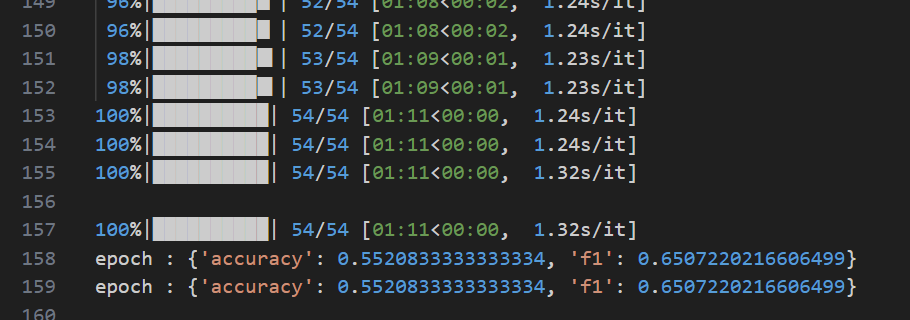

# lab4
## 实验目的
使⽤ Swift、PEFT或其他⼤模型微调框架， 对⼤模型进⾏微调，以解决文本分类问题。
## 实验设计
### 1. 代码框架
1. ``utils.py``: 工具函数包
2. ``ft.py``: 训练脚本,并在验证集上评估模型性能
3. ``eval.py``: 在测试集上评估模型性能
4. ``accelerate_config.ymal``: 配置文件
### 2. 模型与数据集
我们选用**Llama3-8B**作为基础模型,给这个模型接一个分类器头(一个线性层),用于文本分类任务。 

我们选用**Glue/mrpc**作为数据集,下面是这个数据集的介绍:
> The Microsoft Research Paraphrase Corpus (Dolan & Brockett, 2005) is a corpus of sentence pairs automatically extracted from online news sources, with human annotations for whether the sentences in the pair are semantically equivalent.

数据集的字段内容如下:
- **premise**: 第一个句子
- **hypothesis**: 第二个句子
- **label**: 0或1,表示两个句子是否是同义句
- **idx**: 数据集中的索引

字典结构:
|Split|Rows|
|:-:|:-:|
|train|3.67k|
|validation|408|
|test|1.73k|

### 3. 微调框架与配置
我们选用**PEFT框架**、**LoRA方法**进行微调,为了降低显存占用我们参考[这篇文章](https://blog.csdn.net/guojiajiajiu/article/details/138139853)从``Optimizer``,``Model``,``Activation``三个角度进行了**4bit量化**,量化后显存占用大约为**18G**. 

Peft与LoRA配置:
```json
{
    "peft_type": "LORA",
    "auto_mapping": null,
    "base_model_name_or_path": "/data/liaomz/model/llama3-8B",
    "revision": null,
    "task_type": "SEQ_CLS",
    "inference_mode": false,
    "r": 8,
    "target_modules": [
        "q_proj",
        "v_proj"
    ],
    "lora_alpha": 16,
    "lora_dropout": 0.1,
    "fan_in_fan_out": false,
    "bias": "none",
    "use_rslora": false,
    "modules_to_save": [
        "classifier",
        "score"
    ],
    "init_lora_weights": true,
    "layers_to_transform": null,
    "layers_pattern": null,
    "rank_pattern": {},
    "alpha_pattern": {},
    "megatron_config": null,
    "megatron_core": "megatron.core",
    "loftq_config": {},
    "use_dora": false,
    "layer_replication": null
}
```

量化配置:
```json
{
  "_load_in_4bit": true,
  "_load_in_8bit": false,
  "bnb_4bit_compute_dtype": "float16",
  "bnb_4bit_quant_storage": "uint8",
  "bnb_4bit_quant_type": "nf4",
  "bnb_4bit_use_double_quant": true,
  "llm_int8_enable_fp32_cpu_offload": false,
  "llm_int8_has_fp16_weight": false,
  "llm_int8_skip_modules": null,
  "llm_int8_threshold": 6.0,
  "load_in_4bit": true,
  "load_in_8bit": false,
  "quant_method": "bitsandbytes"
}
```
### 4. Prompt设计
我们的目标是区分两个文本含义是否相同,在这里我们把两个句子拼接在一起视为一种二分类任务,在此基础上,我们用下面的方法设计Prompt: 

```python
sentences = [f"{prompt} Sentence 1: {s1} Sentence 2: {s2}" for s1, s2 in zip(examples["sentence1"], examples["sentence2"])]
```

由于我们的目标是区分``s1``与``s2``的含义是否相同,在这里我们尝试了多种Prompt设计,我们做如下约定:

- **No Prompt**: 空字符串
- **Perfect Prompt**: 完美提示了任务内容,在这里我们采用"Does sentence 1 mean the same as sentence 2?"
- **Conflicting Prompt**: 对任务进行了错误引导,在这里我们采用"Bob sent a message to Alice, which one is better?"
- **Insufficient Prompt**: 提示与任务无关,在这里我们采用"Cut the crap, what's your GPA?"

## 实验步骤
### 1. 导入超参数
```python
def main():
    parser = argparse.ArgumentParser()

    # File paths
    parser.add_argument("--model_dir", type=str, default=None)
    parser.add_argument("--tokenizer_dir", type=str, default=None)
    parser.add_argument("--results_path", type=str, default=None)

    # Peft arguments
    parser.add_argument("--task_type", type=TaskType, default=TaskType.SEQ_CLS)
    parser.add_argument("--task", type=str, default="mrpc")
    parser.add_argument("--num_classes", type=int, default=2)

    # LoRA arguments
    parser.add_argument("--r", type=int, default=8)
    parser.add_argument("--lora_alpha", type=int, default=16)
    parser.add_argument("--lora_dropout", type=float, default=0.1)

    # Quantization arguments
    parser.add_argument("--load_in_4bit", type=bool, default=True)
    parser.add_argument("--bnb_4bit_use_double_quant", type=bool, default=True)
    parser.add_argument("--bnb_4bit_quant_type", type=str, default='nf4')
    parser.add_argument("--bnb_4bit_compute_dtype", type=torch.dtype, default=torch.float16)

    # Training arguments
    parser.add_argument("--prompt", type=str, default=None)
    parser.add_argument("--batch_size", type=int, default=8)
    parser.add_argument("--seed", type=int, default=42)
    parser.add_argument("--lr", type=float, default=3e-4)
    parser.add_argument("--epochs", type=int, default=10)
    args = parser.parse_args()
```
### 2. 加载模型与数据集,配置量化参数
```python
    # Accelerator
    set_seed(args.seed)
    accelerator = Accelerator(split_batches=True)

    # Config
    utils.init_logger(accelerator)
    cfg = utils.init_config_from_args(utils.TrainConfig, args)

    quant_config = BitsAndBytesConfig(
        load_in_4bit=cfg.load_in_4bit,
        bnb_4bit_use_double_quant=cfg.bnb_4bit_use_double_quant,
        bnb_4bit_quant_type=cfg.bnb_4bit_quant_type,
        bnb_4bit_compute_dtype=cfg.bnb_4bit_compute_dtype,
    )

    results_path= utils.handle_results_path(cfg.results_path)
    results_path.mkdir(parents=True, exist_ok=True)

    with open(args.results_path + '/config.json', 'w') as json_file:
        json.dump(dataclasses.asdict(cfg), json_file, indent=4, cls=utils.CustomEncoder)

    # Load model and tokenizer
    model = LlamaForSequenceClassification.from_pretrained(cfg.model_dir, num_labels=cfg.num_classes, quantization_config=quant_config)
    tokenizer = AutoTokenizer.from_pretrained(cfg.tokenizer_dir)
        
    tokenizer.pad_token_id = tokenizer.eos_token_id
    model.config.pad_token_id = tokenizer.eos_token_id

    model = prepare_model_for_kbit_training(model)

    # Load data
    datasets = load_dataset("glue", cfg.task)
    metric = evaluate.load("glue", cfg.task)

    train_loader, val_loader, _ = utils.make_dataset(datasets, tokenizer, cfg.batch_size, cfg.prompt)

    loraconfig = LoraConfig(
        task_type=cfg.task_type,
        inference_mode=False,
        r=8,
        lora_alpha=16,
        lora_dropout=0.1,
    )

    # Peft model
    peft_model = get_peft_model(model, loraconfig)
    peft_model.print_trainable_parameters()
```
在这里函数``make_dataset()``完成了对数据的预处理,返回数据加载器:
```python
def make_dataset(data: Dataset, tokenizer, batch_size: int, prompt: str = None) -> tuple[DataLoader, DataLoader, DataLoader]:
    def tokenize_function(examples):
        sentences = [f"{prompt} Sentence 1: {s1} Sentence 2: {s2}" for s1, s2 in zip(examples["sentence1"], examples["sentence2"])]
        return tokenizer(sentences, truncation=True, max_length=None)
    
    tokenized_data = data.map(tokenize_function, batched=True, remove_columns=["idx", "sentence1", "sentence2"])
    tokenized_data = tokenized_data.rename_column("label", "labels")

    def collate_fn(examples):
        return tokenizer.pad(examples, padding="longest", return_tensors="pt")
    
    # 创建DataLoader
    train_loader = DataLoader(tokenized_data["train"], shuffle=True, collate_fn=collate_fn, batch_size=batch_size)
    val_loader = DataLoader(tokenized_data["validation"], shuffle=False, collate_fn=collate_fn, batch_size=batch_size)
    test_loader = DataLoader(tokenized_data["test"], shuffle=False, collate_fn=collate_fn, batch_size=batch_size)
    return train_loader, val_loader, test_loader
```
这里打印出可训练的参数信息为:
```log
trainable params: 3,416,064 || all params: 7,508,348,928 || trainable%: 0.0455
```
### 3. 加载量化后的优化器,部署分布式训练
```python
    optimizer = AdamW8bit(peft_model.parameters(), lr=cfg.lr)
    lr_scheduler = get_linear_schedule_with_warmup(
        optimizer=optimizer,
        num_warmup_steps=0.06 * (len(train_loader) * cfg.epochs),  # 6% of training steps
        num_training_steps=len(train_loader) * cfg.epochs,
    )

    peft_model, train_loader, val_loader, optimizer, lr_scheduler = accelerator.prepare(
        peft_model, train_loader, val_loader, optimizer, lr_scheduler,
    )

    # Training
    for epoch in range(cfg.epochs):
        peft_model.train()
        for step, batch in enumerate(tqdm(train_loader)):
            batch = batch.to(accelerator.device)
        
            outputs = peft_model(**batch)
            loss = outputs.loss
            # Backward pass
            accelerator.backward(loss)
            
            optimizer.step()
            lr_scheduler.step()
            optimizer.zero_grad()
            torch.cuda.empty_cache()

        peft_model.eval()
        for step, batch in enumerate(tqdm(val_loader)):
            batch = batch.to(accelerator.device)
            with torch.no_grad():
                outputs = model(**batch)
                predictions = outputs.logits.argmax(dim=-1)
                references = batch["labels"]
                accelerator.gather(predictions)
                accelerator.gather(references)
                metric.add_batch(
                    predictions=accelerator.gather(predictions),
                    references=accelerator.gather(references),
                )

        eval_metric = metric.compute()
        print(f"epoch {epoch}:", eval_metric)
```
### 4. 保存结果
```python
    if accelerator.is_main_process:
        unwrapped_model = accelerator.unwrap_model(peft_model)
        unwrapped_model.save_pretrained(cfg.results_path + "/llama3_for_cls_lora_weights")
        quant_config.to_json_file(args.results_path + '/quant_config.json')
        lora_json = loraconfig.to_dict()
        with open(args.results_path + '/lora_config.json', 'w') as json_file:
            json.dump(lora_json, json_file, indent=4, cls=utils.CustomEncoder)
```
### 5. 测试
我们把训练集和验证集合并为一个新的训练集,重新微调后测试,代码与上面相似.
## 实验结果
### 1. 微调前的结果
 

这里准确率只有55.2%
### 2. Loss曲线
这里展示了Loss随训练时间的变化,不同Prompt区别不大,这里只展示了其中一个Prompt的结果 

 
### 3. 不同Prompt微调过程中的差异
这里展示了准确率随训练时间的变化 

 

我们可以观察到最后的结果其实各个Prompt的差异不大,但是Perfect Prompt在训练过程中最稳定,而且,出乎意料的是,前期表现的最差的不是Conflicting Prompt而是Insufficient Prompt. 
最终Perfect Prompt的效果最好,达到了88.8%的准确率.